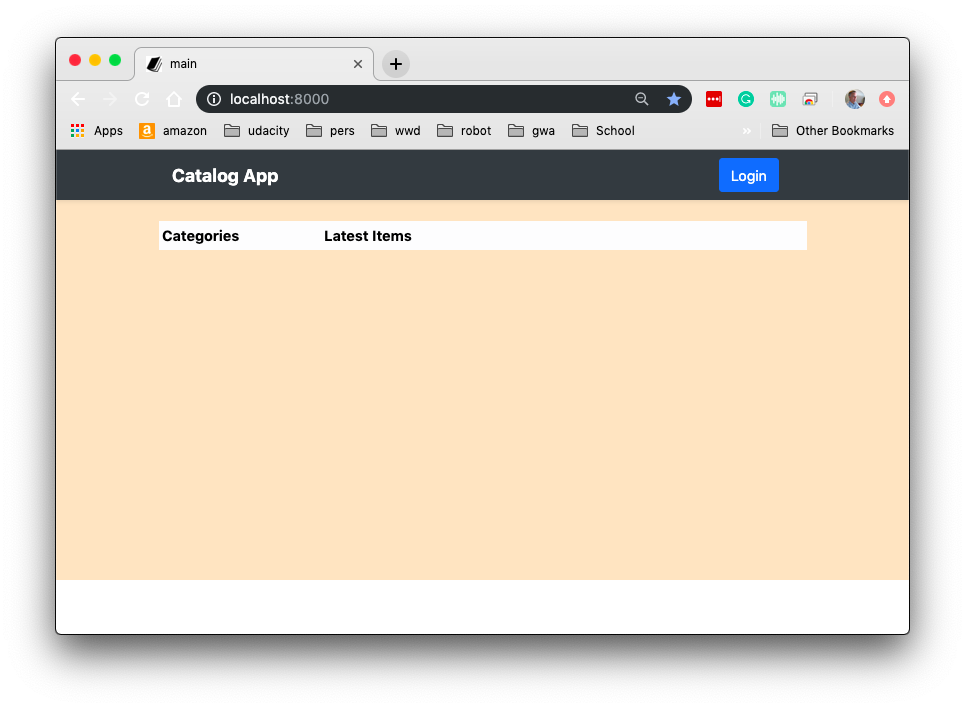
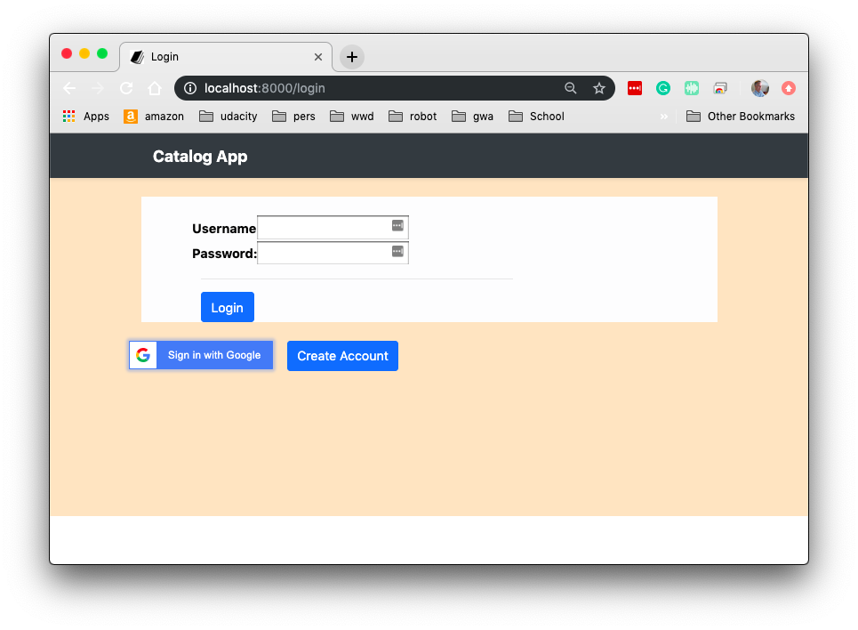

# Project - Item Catalog
## Udacity Full Stack Nano Degree  

## About

This project implements a list of items within a variety of categories, and integrates third party 
user registration and authentication.  In addition, the application offers a simple
user + password authentication as well.  The third party authentication used is by way 
of google.  

Any user can view categories and items, however in order to add, modify or delete, the 
user must be authenticated.  In addition, in order to modify or delete a category,
the user must be the owner / creator of the item.  

Some of the technologies used in this application include:
* Flask 
* Bootsrap
* Jinja2
* SQLite

---

## Installation and execution
In order to install and execute, download or install the following:
* [Virtual Box](https://www.virtualbox.org/wiki/Downloads)
* [Install vagrant](https://www.vagrantup.com/)
* [Clone this repository](https://github.com/jcarter62/udacity-item-catalog.git)
---
* open a command line and change current directory to where you cloned the repository.
* perform _vagrant up_, and wait for a command prompt to return.
* perform _vagrant ssh_
* cd /vagrant/catalog
* execute _python app.py_
* open browser, and visit http://localhost:8000
* if first time running, login in order to add categories or items.

## Walkthrough Images

Startup

Login

